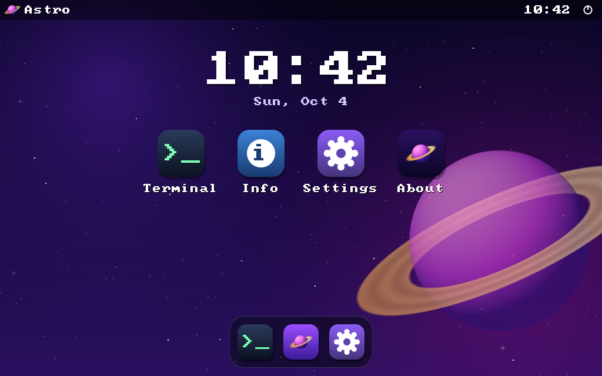
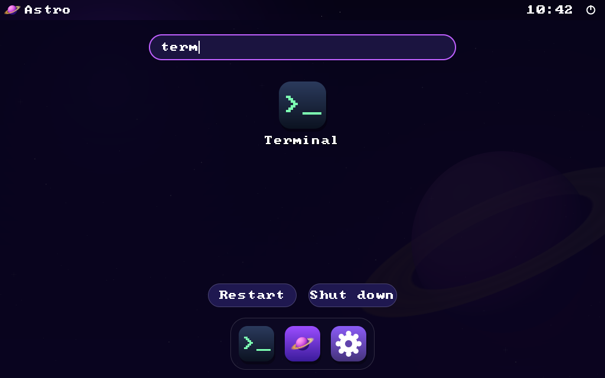
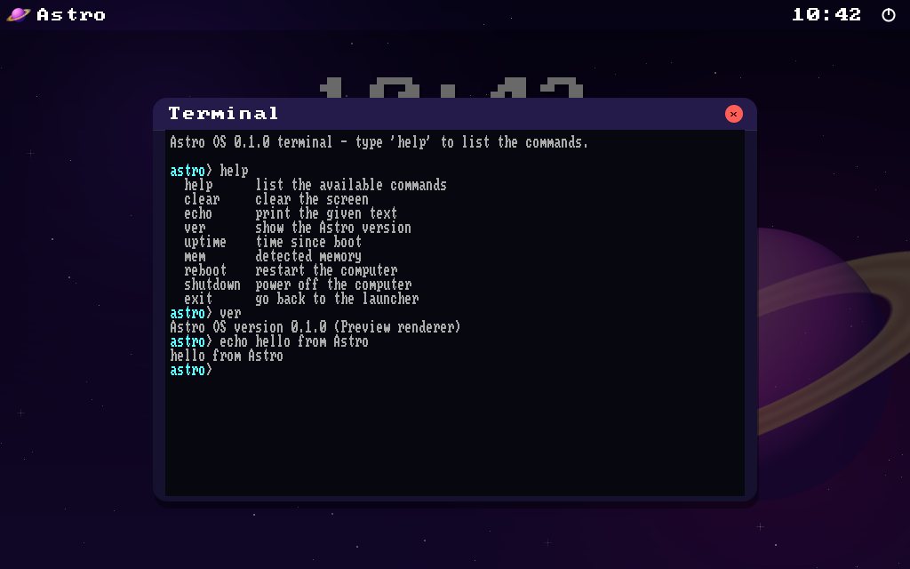
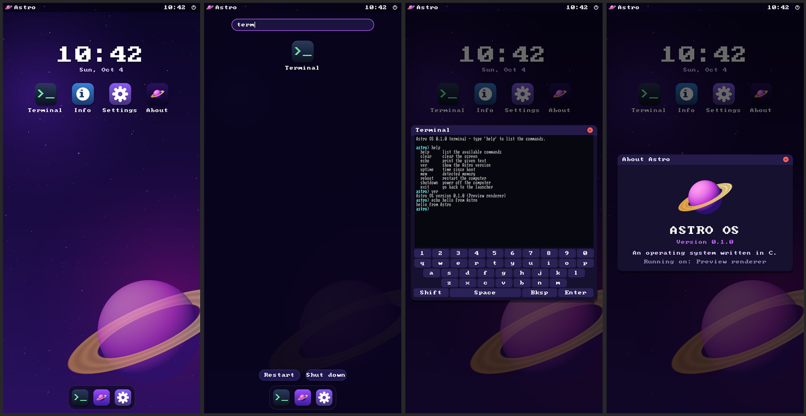

# Astro

<p align="center">
  
</p>

Astro is a small operating system written in C, with a graphical home screen, a launcher and a terminal.

It does **not** replace Windows (or Android). You can try it safely in three ways:

| Target | What it is |
| --- | --- |
| **Windows simulator** (`astro-sim.exe`) | A normal Windows program that shows the Astro home screen in a window. |
| **Android app** (`astro.apk`) | The same home screen packaged as an app, with touch and an on-screen keyboard. |
| **Bare-metal kernel** (`astro.elf`) | The real x86 kernel, for QEMU, VirtualBox or VMware (text-mode launcher). |

<p align="center">
  
  
</p>
<p align="center">
  
  
</p>

## Download

Every push builds everything on GitHub Actions. Open the **Actions** tab, pick the latest run and download:

- `astro-sim-windows` - the simulator (`astro-sim.exe`), just double-click it
- `astro-android` - the Android app (`astro.apk`, signed with a debug key; install it with `adb install` or sideload it)
- `astro-kernel` - the bare-metal kernel (`astro.elf`) for QEMU
- `astro-preview` and `astro-android-screenshots` - rendered frames and emulator screenshots

The workflow also installs the APK on an Android emulator, launches it, types into it and fails if it crashes.

## The home screen

- Boot splash, wallpaper with three themes (Nebula, Ocean, Sunset), clock and date
- App grid and dock, with the **Astro Launcher** button in the middle of the dock
- **Astro Launcher**: full-screen overlay with search. On a keyboard just start typing on the home screen,
  press Enter to open the first match and Esc to close. It also has Restart and Shut down.
- Apps: Terminal, System Info, Settings (theme, clock seconds) and About
- Mouse or touch; the terminal gets an on-screen keyboard on touch devices
- Power menu in the status bar (Restart / Shut down)

The Terminal runs the same shell as the real kernel: `help clear echo ver uptime mem reboot shutdown exit`.

## Project layout

```text
src/kernel/    portable core: VGA text layer, kprintf, shell, boot log, platform interfaces
src/desktop/   graphical home screen: software renderer (gfx), font, desktop.c (UI and apps)
src/sim/       Windows simulator host (Win32 window, input, timer)
src/android/   Android host (NativeActivity: surface, touch, keys)
src/arch/x86/  bare-metal backend: GDT, IDT, PIC, PIT timer, PS/2 keyboard, VGA memory, power
src/apps/      text-mode launcher used by the bare-metal kernel
src/boot/      Multiboot entry (boot.S) and CPU/interrupt stubs (cpu.S)
android/       manifest, icon resources and the scripts that build and test the APK
assets/        launcher icon (SVG), the simulator .ico and screenshots
tools/         make-icon.ps1 (regenerates the .ico) and preview.c (renders frames to BMP)
linker.ld      kernel memory layout (loaded at 1 MiB)
```

The graphical hosts only provide a pixel buffer, input events, a clock and power handling
(see `src/desktop/desktop.h` and `src/desktop/platform.h`), so `desktop.c` is shared by the
Windows simulator and the Android app.

## Building

### Windows simulator

Requires MSYS2 (MinGW-w64 gcc and make):

```sh
# in an MSYS2 MINGW64 shell
pacman -S make mingw-w64-x86_64-gcc
make sim
./build/sim/astro-sim.exe
```

`make preview` renders frames of the home screen to `build/preview/shots` without opening a window.

### Android app

Requires the Android SDK (platform, build-tools) and NDK, plus a JDK. No Gradle needed:

```sh
make android          # or: bash android/build-apk.sh   (works in Git Bash on Windows too)
adb install -r build/astro.apk
```

`ABIS=x86_64 make android` builds only one architecture, which is faster for emulator testing.

### Bare-metal kernel

Requires `make`, a 32-bit capable C compiler and QEMU. On Windows use WSL (Ubuntu):

```sh
sudo apt install build-essential gcc-multilib qemu-system-x86
make CROSS= run
```

With an `i686-elf-gcc` cross-compiler, use plain `make run`.
`make iso` builds a bootable ISO (needs `grub-mkrescue` and `xorriso`).
The bare-metal kernel still uses the text-mode launcher; a graphical framebuffer needs a
GRUB-provided video mode and a mouse driver, which are not written yet.

## Launcher icon

- `assets/astro-launcher.svg`: vector version (512x512), a ringed planet with stars.
- `src/apps/launcher_icon.c`: the same art as a 16x16 grid, drawn in text mode with half blocks.
- `assets/astro.ico`: generated from that grid by `tools/make-icon.ps1` and embedded in `astro-sim.exe`.
- `android/res`: the Android adaptive icon, drawn as a vector.

## License

See [LICENSE](LICENSE).
